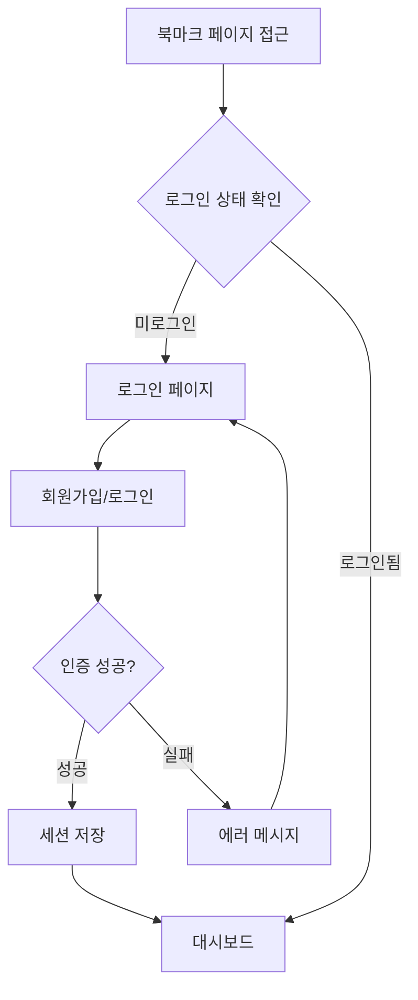
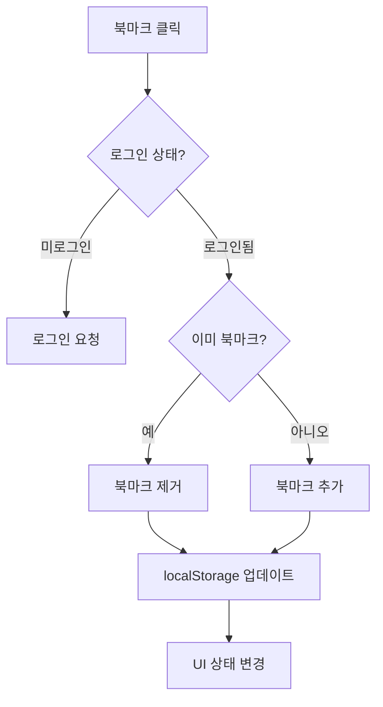
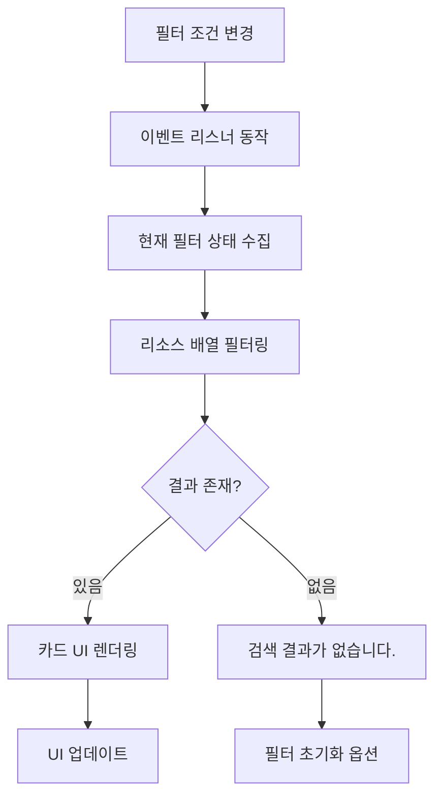

<div align="center">


</div>
<br />
<hr>
<br />

<h3>🏆프로젝트 성과</h3>
- 총 8개 핵심 컴포넌트 개발<br />
- 4개 완성된 페이지 구현<br />
- TypeScript 기반 타입 안전성 확보<br />
- 프론트엔드 환경 안전한 인증 시스템 구현<br />
- GitHub API 실시간 연동 및 캐싱 시스템<br />
- 완전한 반응형 웹 디자인<br />
<br />
<br />

<h3>📌핵심 기능</h3>

<h4>🏠 대시보드</h4>

**구현 내용** <br />
- 오늘의 리소스: 매일 랜덤 추천 리소스 제공<br />
- GitHub 인기 레포지토리: 실시간 트렌딩 레포지토리 표시<br/>
- 캐싱 시스템을 통한 API 호출 최적화 <br/>

**동작 원리** <br />
1. GitHub REST API 호출 (Octokit 라이브러리 사용) <br/>
2. 스켈레톤 UI가 작동 <br/>
2. 응답 데이터를 localStorage에 캐싱 (10분마다 갱신) <br/>
3. 캐시 유효성 검사 후 필요시에만 새로운 API 호출 <br/>
4. 언어별 색상 매핑으로 시각적 구분 <br/>

<h4>🔍 리소스 탐색</h4>

**구현 내용** <br />
- 다중 조건 필터링 (카테고리, 기술스택, 난이도, 언어)<br />
- 리소스 카드 UI (태그, 난이도, 북마크 버튼 포함)<br />
- 상세 모달 시스템<br />
- 반응형 그리드 레이아웃<br />

**동작 원리** <br />
1. 필터 조건 변경 시 JavaScript 이벤트 리스너 동작 <br/>
2. 배열 필터링 메서드로 조건에 맞는 리소스 추출 <br/>
3. DOM 조작으로 실시간 UI 업데이트 <br/>
4. 모달 오픈 시 해당 리소스 데이터 바인딩 <br/>

<h4>🔐 사용자 인증</h4>

**구현 내용** <br />
- 회원가입: 이메일, 비밀번호, 본인확인 질문/답변<br />
- 로그인: bcrypt 비밀번호 검증<br />
- 비밀번호 찾기: 본인확인 질문 기반 재설정<br />
- 인증 상태 관리 및 UI 변화<br />

**동작 원리** <br />
1. 회원가입 시 bcrypt로 비밀번호 해싱 후 localStorage 저장 <br/>
2. 로그인 시 입력된 비밀번호와 저장된 해시 비교 검증 <br/>
3. 인증 성공 시 세션 토큰 생성 및 localStorage 저장 <br/>
4. 페이지 로드 시 인증 상태 확인 후 UI 조건부 렌더링 <br/>

<h4>📌 북마크 & 컬렉션</h4>

**구현 내용** <br />
- 북마크 추가/제거 기능<br />
- 컬렉션 생성 및 관리 (5자 이내, 중복 방지)<br />
- 드래그 앤 드롭 순서 변경<br />
- 컬렉션별 리소스 분류<br />

**동작 원리** <br />
1. 북마크 클릭 시 사용자 인증 상태 확인 <br/>
2. 로그인 상태일 경우 localStorage의 북마크 배열에 추가/제거 <br/>
3. 컬렉션 생성 시 유효성 검사 (길이, 중복) 수행 <br/>
<br/>
<br/>


<h3>🖥️ 페이지별 화면 구성</h3> 
 <table align="center">
  <tr>
    <th align="center">페이지</th>
    <th align="center" colspan="2">GIF 시연</th>
  </tr>
  
  <tr>
    <td align="center"><strong>대시보드</strong></td>
    <td align="center"></td>
    <td align="center"></td>
</tr>
<tr>
    <td align="center"><strong>리소스</strong></td>
    <td align="center"></td>
    <td align="center"></td>
</tr>
<tr>
    <td align="center"> <strong>로그인</strong></td>
    <td align="center"></td>
    <td align="center"></td>
</tr>
<tr>
    <td align="center"><strong>북마크</strong></td>
    <td align="center"></td>
    <td align="center"></td>
</tr>
</table>
<br />
<br />

<h3>🔄 프로젝트 워크 플로우</h3>

<details>
<summary>🔄 플로우 차트 보기</summary>

<h4>사용자 인증 플로우</h4>



<h4>북마크 기능 플로우</h4>



<h4>GitHub API 캐싱 플로우</h4>


<h4>리소스 필터링 플로우</h4>



</details>
<br />

<h3>📂 프로젝트 폴더 구조</h3>

<details>
<summary>📂 폴더 구조 보기</summary>

```text
📦 src
├── 📂 api
│   └── 📜 githubApi.ts
├── 📂 components
│   ├── 📂 Button
│   │   └── 📜 button.html
│   ├── 📂 DailyResources
│   │   ├── 📜 daily-resources.html
│   │   └── 📜 daily-resources.ts
│   ├── 📂 Footer
│   │   └── 📜 footer.html
│   ├── 📂 GithubCard
│   │   ├── 📜 github-card.html
│   │   └── 📜 githubCard.ts
│   ├── 📂 Header
│   │   └── 📜 header.html
│   ├── 📂 Modal
│   │   └── 📜 modal.html
│   ├── 📂 ResourceCard
│   │   └── 📜 resource-card.html
│   ├── 📂 Sample
│   │   └── 📜 sample.html
│   └── 📂 Sidebar
│       ├── 📜 sidebar.html
│       └── 📜 sidebar.ts
├── 📂 data
│   ├── 📜 colors.json
│   └── 📜 resource.json
├── 📂 pages
│   ├── 📂 .git
│   ├── 📜 bookmark.html
│   ├── 📜 login.html
│   └── 📜 resource.html
├── 📂 script
│   ├── 📜 bookmarkRendering.ts
│   ├── 📜 collectionModal.ts
│   ├── 📜 collectionRendering.ts
│   ├── 📜 dailyResources.ts
│   ├── 📜 filter.ts
│   ├── 📜 header.ts
│   ├── 📜 login.ts
│   ├── 📜 modalRendering.ts
│   └── 📜 resourceRendering.ts
├── 📂 service
│   ├── 📜 auth.ts
│   └── 📜 bookmark.ts
├── 📂 types
│   ├── 📜 bookmark.type.ts
│   ├── 📜 github.type.ts
│   ├── 📜 resource.type.ts
│   └── 📜 user.type.ts
├── 📜 main.ts
├── 📜 style.css
└── 📜 vite-env.d.ts
```
</details>
